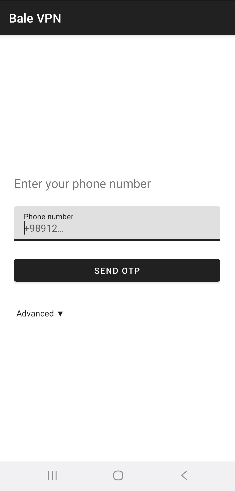
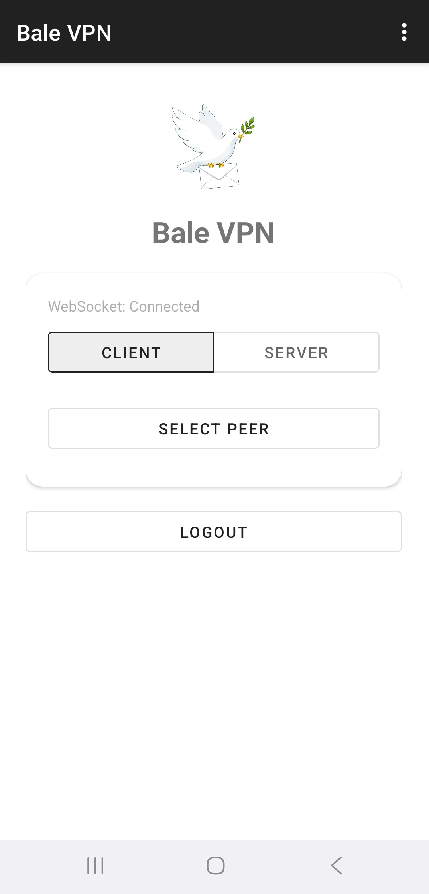
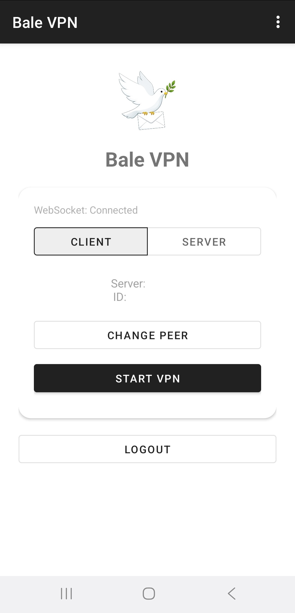
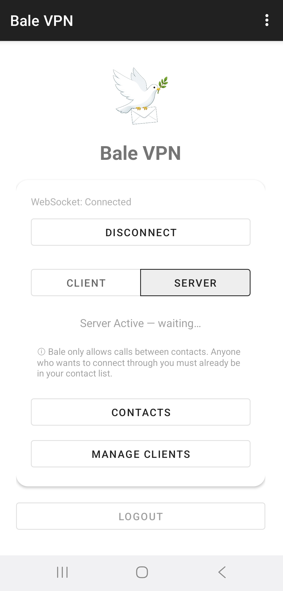
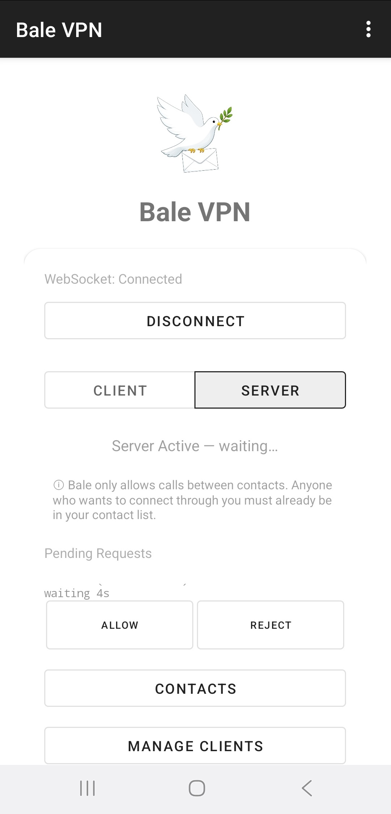
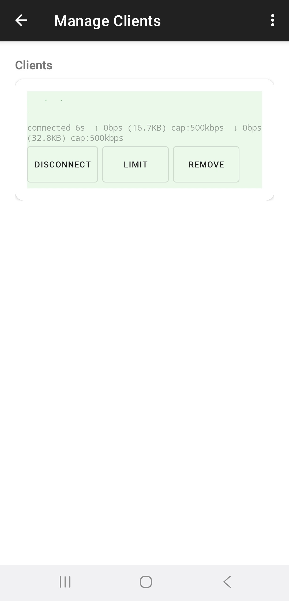

# Android app — user guide

The Android app is a Kotlin Multiplatform VPN app that runs in either **client mode** (routes the device's traffic through a peer) or **server mode** (auto-answers calls from peers and bridges their traffic to the open internet via an in-process userspace TCP/IP stack). No root, no kernel TUN, no `iptables`.

> Persian / فارسی: [راهنمای کاربری اپلیکیشن اندروید](android-fa.md)

### Why no root?

In **server** mode the app implements its **own TCP/IP stack inside the process** and does NAT entirely in userspace — incoming IP packets from a peer are terminated, routed, and forwarded to the open internet without touching the kernel's networking stack. That's why server mode runs from a plain APK on any phone, with no root and no special privileges.

This was a deliberate design choice for **user convenience** — anyone can install and run the server. The trade-off is performance: a rooted device using the kernel's TCP/IP stack and a real TUN device would be measurably faster. If you have access to a Linux box, the [Linux Node TUN VPN server](node-en.md#linux-vpn-server-tun--full-ip-routing) is the high-throughput option (kernel-level NAT instead of userspace).

---

## What you need

- **Two Android devices**, both signed in to Bale.
- Each device must have the other in its Bale **contact list** — Bale only allows calls between mutual contacts.
- One device with a working internet connection (the **server**); one that wants to use it (the **client**).

## 1 · Install and sign in

Download the latest APK from the repository's [Releases](../../../releases) page and install it. Open the app, enter your phone number, confirm the SMS code, and sign in. **Do this on both devices.**

## 2 · Client device (consumes internet)

1. Toggle the mode switch to **Client**.
2. Tap **Select Peer** and pick the contact that will act as the server.
3. Tap **Start VPN**. Android shows a system VPN-permission dialog — **Allow**.
4. Done. All traffic from this device now flows through the server. Live throughput appears below the button.

To disconnect, press **Disconnect**.

## 3 · Server device (provides internet)

1. Toggle the mode switch to **Server**. The foreground service starts automatically and waits for incoming calls.
2. (Optional) **Contacts** — add anyone else by phone number who should be able to connect to you.
3. (Optional) **Manage Clients** — set per-client bandwidth caps. Default is 300 kbps; max 500 kbps.

When someone outside the allow-list calls in, you'll get a notification to **Accept** or **Reject**. Pending requests auto-reject after 60 seconds.

The **Manage Clients** screen shows every active client with its live throughput, total bytes, and the current bandwidth cap. Each row has its own Disconnect button.

To stop the server, toggle the mode back to **Client**. To disconnect every active client without stopping the server (e.g., before sleep), press the WebSocket Disconnect button.

## 4 · Sharing the tunnel with other devices (optional)

The Android client only routes its own traffic. To share the same internet with a laptop or another phone, install a HTTP/SOCKS proxy app on the client device (e.g., **EveryProxy**), turn the client device into a Wi-Fi hotspot (or join the same Wi-Fi), then point the other devices at the proxy address shown by EveryProxy.

## Notes

- Bale only allows calls between mutual contacts — both phones must save the other's number.
- The app needs no root and no special privileges.
- In server mode, the device must stay on with the app in the foreground or background — the foreground service keeps it alive.
- Bale's servers see the connection as a long voice call. **They can see your destinations and any unencrypted payload** — see the [privacy note](../README.md#-privacy--encryption) in the main README.

