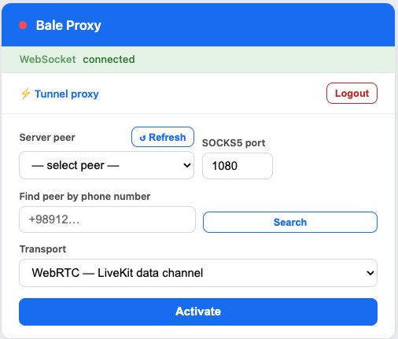
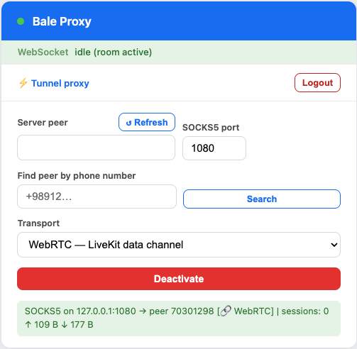

# Node.js application — Linux / macOS / Windows

> Persian / فارسی: [راهنمای نسخهٔ Node](node-fa.md)

The Node.js package (`bale-vpn-node/`) is a single-binary tool that combines:

- a Bale WebSocket signaling client,
- a local **web UI** on `http://localhost:3001` — **auto-opened in your default browser** on launch in client mode. All configuration (signing in, picking a peer, activating the tunnel) is done from that page; there is no terminal-based config flow.
- a **SOCKS5 proxy** mode for both client and server,
- a **kernel TUN VPN server** mode (Linux + macOS) that lets Android clients connect with full IP routing.

The same binary runs on Linux, macOS, and Windows. The VPN-server mode is Linux-only because it relies on a kernel TUN device and `iptables` MASQUERADE. Set `BALE_NO_BROWSER=1` if you want to suppress the auto-open (e.g., headless dev).

## Modes at a glance

| Mode | Platform | What it does |
|---|---|---|
| **SOCKS5 client** | Linux / macOS / Windows | Listens on `127.0.0.1:1080`, tunnels TCP through the chosen Bale contact (the contact must be running a server). |
| **SOCKS5 server** | Linux / macOS / Windows | Auto-answers Bale calls and relays the caller's TCP traffic. Useful for tunneling without VPN setup. |
| **VPN server (TUN)** | **Linux / macOS** | Auto-answers Bale calls, terminates raw IP traffic on a kernel TUN device (`bale0` on Linux, `utunN` on macOS), and uses kernel NAT (iptables MASQUERADE on Linux, pf on macOS) to forward everything to the open internet. |

Same binary, behaviour selected at startup by command-line argument (`server` for server mode; default is client).

---

## Quick start

### Run from a release binary

Download a prebuilt `balevpn-<version>-<platform>` binary from the repository's [Releases](../../../releases) page.

```bash
# Linux / macOS:
chmod +x balevpn-*-{linux,macos}-*
./balevpn-...           # client mode (default), web UI at http://localhost:3001
./balevpn-... server    # server mode

# Windows (PowerShell):
.\balevpn-...-win-x64.exe
.\balevpn-...-win-x64.exe server
```

In **client mode** the binary auto-opens `http://localhost:3001` in your default browser — that's the entire configuration surface (sign in, pick a Bale contact, click Activate). Server mode does not auto-open since servers commonly run on headless hosts.

---

## Web UI

When you launch in client mode, the binary opens `http://localhost:3001` in your default browser. The UI flow:

1. **Sign in** — phone number → SMS code, or paste an `access_token` JWT cookie from `web.bale.ai` directly. Once signed in, the token is persisted in browser `localStorage` so it survives reloads.

   <p align="center"></p>

2. **Tunnel proxy** — pick a Bale contact from the list (or search by phone number to pull in a new one), choose a SOCKS5 port (default 1080), and click **Activate**.

   <p align="center"></p>

3. The status row turns green when the WebRTC tunnel is up. From this point your apps can use `127.0.0.1:1080` as a SOCKS5 proxy and the traffic flows through the chosen contact.

   <p align="center"></p>

In server mode the UI also shows live **Connected clients**, a **Pending requests** queue with Accept/Reject buttons, and an **Allowed callers** allow-list — see [Server admission control](#server-admission-control) below.

---

## SOCKS5 client mode

### What SOCKS5 is and isn't

SOCKS5 is a per-application TCP relay protocol — your application opens a connection to `127.0.0.1:1080` and the proxy forwards it through the tunnel. This is **not** a system-wide VPN: only apps you configure to use the proxy go through the tunnel; everything else uses your real internet directly. This is intentional and useful — you can browse one site through the tunnel and everything else locally — but it also means **a misconfigured app will silently bypass the tunnel**.

Other limitations of SOCKS5 vs. a real VPN:

- **TCP only.** UDP (including QUIC, some video calls, multicast, etc.) is not relayed. If a site requires QUIC and the browser doesn't fall back to TCP/HTTPS, that site won't work. (The Node tunnel's wire format does carry a UDP-relay frame, but most browsers will not emit UDP through SOCKS5.)
- **No ICMP**, so `ping` from your machine still uses your real internet.
- **No raw IP**, so things like WireGuard or other VPN clients running on top will not be tunneled.

If you want full IP routing instead, use the Android app or run the [Linux TUN VPN server](#linux-vpn-server-tun--full-ip-routing) and connect with the Android client.

### Activating the tunnel

The client picks any Bale contact (who must be running a server — Node or Android) and routes TCP via that peer. Steady-state traffic flows on the LiveKit data channel; the Bale WebSocket is only used briefly for signaling and is dropped once the LK channel is up (and brought back up automatically when reconnect signaling is needed).

Once activated, point any SOCKS5-aware app at `127.0.0.1:1080`.

### Configuring a browser as a client

> ⚠️ **Use a separate browser (or browser profile) for the tunnel.** The local web UI lives at `http://localhost:3001`. If you set `127.0.0.1:1080` as the SOCKS5 proxy in the same browser you used to manage the tunnel, every page in that browser — including the UI itself — will try to go through the proxy. As soon as anything goes wrong with the tunnel, you can no longer reach the UI to fix it. Keep one browser/profile for managing the tunnel and a different one for tunneled traffic.

> ⚠️ **Make sure DNS goes through the proxy too.** By default many browsers resolve hostnames locally and only send the IP to the SOCKS5 server — so even though your TCP traffic is tunneled, your DNS lookups still leak to your local resolver, defeating the point of the tunnel for blocked-domain access.
>
> The Node SOCKS5 server *does* support remote name resolution (it accepts SOCKS5 ATYP=0x03 hostnames), so the only thing required is that **the client send the hostname instead of resolving it first**:
>
> - **Firefox** — Settings → Network Settings → Manual proxy → SOCKS v5 host `127.0.0.1`, port `1080`, and tick **Proxy DNS when using SOCKS v5** (or set `network.proxy.socks_remote_dns = true` in `about:config`).
> - **Chrome / Chromium / Edge** — launch with `--proxy-server="socks5://127.0.0.1:1080"`. Chrome resolves DNS through the SOCKS5 server when started this way. Browser extensions like *FoxyProxy* / *SwitchyOmega* expose the same setting in their UI; make sure "remote DNS" is on.
> - **`curl`** — use `--socks5-hostname 127.0.0.1:1080` (NOT `--socks5`, which resolves locally first).
> - **Other tools** — look for an option named "remote DNS", "SOCKS5h", or "tunnel DNS lookups". The `socks5h://` URL scheme is the canonical way to ask for hostname-passthrough.

### The Node SOCKS5 client (this app)

When you set up *another* Node instance as the **client side** (i.e., running this app and connecting to a remote Node/Android server), the built-in SOCKS5 listener follows the same rule: it accepts ATYP=0x03 (hostname), ATYP=0x01 (IPv4), and ATYP=0x04 (IPv6). The hostname is forwarded verbatim to the server, which performs the DNS lookup. **The app never resolves DNS locally before tunneling**, so there is no DNS leak from the Node client itself. DNS leakage on your machine therefore comes only from the *application* configuration (your browser settings above).

### Privacy

Application-layer encryption (HTTPS / TLS) is what actually keeps your payload private from the server peer and from Bale's LiveKit infrastructure. See the [privacy note](../README.md#-privacy--encryption) in the main README.

---

## SOCKS5 server mode (any OS)

Run the binary with the `server` argument. It listens for incoming Bale calls, auto-answers (subject to the allow-list — see below), and acts as a TCP relay for the caller. No system privileges needed.

```bash
./balevpn-... server
```

This is the easiest way to give a friend a relay if you don't want to set up a VPN. The caller uses Node SOCKS5 client mode (or any SOCKS5 client) and gets transparent TCP forwarding.

---

## VPN server (TUN) — full IP routing

This is the **highest-throughput** server option, available on Linux and macOS. The Node process attaches to a kernel TUN device (`bale0` on Linux, `utunN` on macOS) and the kernel handles forwarding + NAT, which is substantially faster than the userspace TCP/IP stack used by the Android server.

Recommended pairing: **Node TUN server + Android client** for the best connection on the client side (Android `VpnService` ships every IP packet from the device into the tunnel).

### Linux — one-time setup

```bash
# 1. Allow the released binary to manage TUN interfaces without running as root.
#    Apply setcap to the actual file you'll execute — NOT to /usr/bin/node.
sudo setcap cap_net_admin+eip ./balevpn-<version>-linux-x64

# 2. Tell the kernel to NAT traffic from the tunnel subnet out the host's
#    real interface (run once; survives reboots only if added to your
#    distro's iptables-save / firewalld config)
sudo iptables -t nat -A POSTROUTING -s 10.8.0.0/24 -j MASQUERADE
```

Then run:

```bash
./balevpn-<version>-linux-x64 server
```

### macOS — run with sudo

macOS has no `setcap` analog, so server mode runs as root. NAT (pf anchor `balevpn`) and IP forwarding are loaded automatically on startup; the WAN interface is auto-detected via `route -n get default`.

```bash
sudo ./balevpn-<version>-macos-arm64 server
```

### What the server does on startup

1. Removes any stale TUN interface from a prior run.
2. Creates the TUN device and assigns `10.8.0.1/24`.
3. Enables IPv4 forwarding (`/proc/sys/net/ipv4/ip_forward` on Linux, `net.inet.ip.forwarding` on macOS).
4. Loads the platform-specific NAT rule (iptables MASQUERADE on Linux, pf anchor on macOS).
5. Subscribes to Bale incoming-call updates and starts auto-answering.

When an Android client connects, it gets `10.8.0.2/24` and routes all of its traffic into the tunnel. Up to 253 clients can connect simultaneously — the server transparently rewrites each client's source address to a distinct IP in `10.8.0.0/24` so the kernel can disambiguate concurrent flows.

### Limitations

- IPv4 only. IPv6 packets from the client are explicitly dropped (the Android client falls back to IPv4 fast via ICMPv6 Destination Unreachable).

---

## Server admission control

Whether running as SOCKS5 server or TUN VPN server, every incoming call from a contact who isn't on the allow-list lands in a **pending** queue. The web UI surfaces it as a yellow row with **Accept once / Allow always / Reject** buttons.

<p align="center"></p>

- "Accept once" handles this single call but doesn't persist the caller.
- "Allow always" persists the caller's user-id to `bale-vpn-node/.allowed-callers.json`. Future calls from the same caller auto-accept.
- "Reject" sends a `DiscardCall` so the caller's tunnel tears down immediately instead of waiting for a timeout.
- Pending entries auto-reject after 60 s.

Connected clients show their resolved Bale contact name (and user-id) in the **Connected clients** card. Each row has its own Disconnect button.

<p align="center"></p>

---

## Authentication

Two ways to get an `access_token` JWT into the app:

1. **Phone OTP via the UI** — enter your phone, type the SMS code, the binary fetches the cookie via the standard `web.bale.ai/set-cookie/?jwt=…` flow and stores it in browser `localStorage`. This is the recommended path.
2. **Paste a token** — copy the `access_token` cookie from a logged-in `web.bale.ai` Chrome session (DevTools → Application → Cookies) and paste it into the textarea on the UI.

WebSocket close code `4401` means the token expired; sign in again.

---

## Privacy & encryption

The LiveKit data channel is encrypted with DTLS, so traffic is opaque to passive observers on the network. **However**, Bale's LiveKit servers act as the SFU/TURN node and have access to the plaintext media — they can see your destinations and any unencrypted application payload. Use TLS at the application layer (HTTPS, encrypted DNS, etc.) and treat this tunnel like a VPN whose operator you don't fully trust.

See the [main README](../README.md#-privacy--encryption) for a fuller note.
