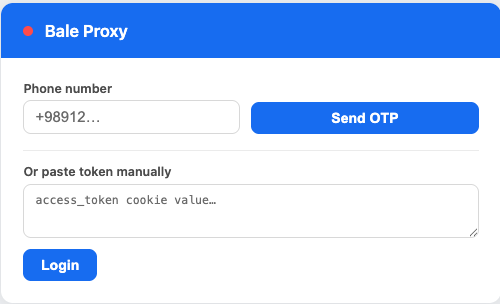
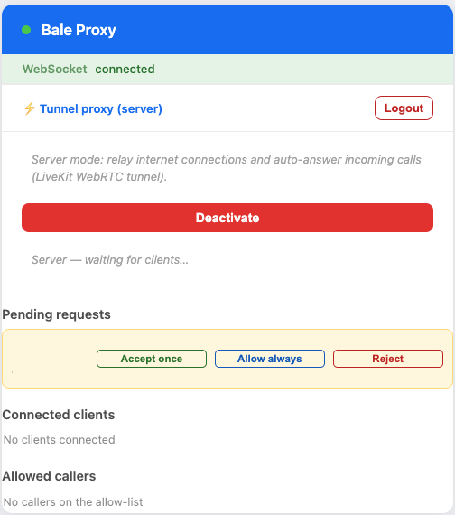
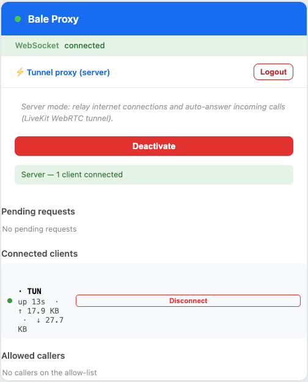

# Node.js application — Linux / macOS

> Persian / فارسی: [راهنمای نسخهٔ Node](node-fa.md)

The Node application (`bale-vpn-node/`) is a single-binary **VPN server**. It listens for incoming Bale calls from allow-listed contacts and bridges each caller's IP traffic to the open internet.

- Binary builds for Linux and macOS.
- Two forwarding strategies, chosen at startup:
  - **kernel TUN** — the kernel handles IP forwarding and NAT (`iptables` MASQUERADE on Linux, `pf` anchor on macOS). Highest throughput. Requires a one-time root step.
  - **userspace NAT** — runs unprivileged. Per-flow Rust TCP / UDP state machine inside the process.
- A local **web UI** at `http://localhost:3001` is the only configuration surface — sign-in, allow-list management, pending requests, connected-client view.

> The Node application currently runs as **server only**. For the client side, use the [Android app](android-en.md).

## Modes at a glance

| Mode | Privileges | Throughput |
|---|---|---|
| `--nat-mode kernel` | One-time root (`setcap` + `iptables` on Linux, runs as root on macOS) | Highest — kernel-managed TUN device + native NAT |
| `--nat-mode userspace` | None | Lower than kernel mode but fully featured (SACK, RACK, TLP, PRR, Window Scaling, Timestamps) |

The default is `kernel`.

---

## Quick start

### Run from a release binary

Download a prebuilt `balevpn-<version>-<platform>` binary from the repository's [Releases](../../../releases) page.

```bash
chmod +x balevpn-<version>-{linux,macos}-*
./balevpn-...                             # default port 3001, default mode
./balevpn-... 8080                        # custom UI port
./balevpn-... --nat-mode=userspace        # force userspace NAT
```

### Command-line arguments

| Argument | Default | Meaning |
|---|---|---|
| `<integer>` (positional) | `3001` | HTTP port for the management UI. Any bare number is taken as the port. |
| `--nat-mode kernel\|userspace` | `kernel` | Selects how server-side forwarding works. `kernel` requires the one-time setup linked below; `userspace` runs with no privilege. The mode is fixed at startup. |

If `--nat-mode=kernel` is selected but the required kernel privileges or `iptables` MASQUERADE rule are missing, the process exits with an actionable error rather than silently degrading.

The web UI binds to **`127.0.0.1` only** — it's never reachable from another machine over the network. For a headless server, use SSH local port forwarding to reach it from your laptop:

```bash
ssh -L 3001:127.0.0.1:3001 user@your-server
```

then open `http://localhost:3001` in your local browser. The forwarding tunnel must stay open while you're using the UI.

---

## Kernel-TUN one-time setup

### Linux

```bash
# 1. Allow the binary to manage TUN interfaces without running as root.
#    Apply setcap to the actual file you'll execute — NOT to /usr/bin/node.
sudo setcap cap_net_admin+eip ./balevpn-<version>-linux-x64

# 2. Enable IPv4 forwarding (and make it survive reboots).
sudo sysctl -w net.ipv4.ip_forward=1
echo 'net.ipv4.ip_forward = 1' | sudo tee /etc/sysctl.d/99-bale-vpn.conf

# 3. NAT the tunnel subnet out the host's real interface.
sudo iptables -t nat -A POSTROUTING -s 10.8.0.0/24 -j MASQUERADE
```

Then run:

```bash
./balevpn-<version>-linux-x64
```

### macOS

macOS has no `setcap` analog, so kernel-TUN mode runs as root. NAT (pf anchor `balevpn`) and IP forwarding are loaded automatically on startup; the WAN interface is auto-detected via `route -n get default`.

```bash
sudo ./balevpn-<version>-macos-arm64
```

### Userspace NAT

No privileged setup needed. Just run the binary with `--nat-mode=userspace`.

```bash
./balevpn-<version>-linux-x64 --nat-mode=userspace
```

### What the server does on startup

1. Loads the saved Bale `access_token` (if any) from `${RUNTIME_DIR}/.bale-vpn_config.json`.
2. If kernel-TUN mode: removes any stale TUN interface, creates a new one, assigns `10.8.0.1/24`, enables IPv4 forwarding, and loads the platform-specific NAT rule (iptables MASQUERADE on Linux, pf anchor on macOS).
3. Starts the local web UI on the chosen port.
4. Connects to the Bale signaling WebSocket and waits for incoming calls.

When an Android client connects, it gets `10.8.0.2/24` and routes all of its traffic into the tunnel. Up to 253 clients can connect simultaneously — the server transparently rewrites each client's source address to a distinct IP in `10.8.0.0/24` so the kernel (or the userspace NAT) can disambiguate concurrent flows.

### Limitations

- IPv4 only. IPv6 packets from the client are explicitly dropped (the Android client falls back to IPv4 fast via ICMPv6 Destination Unreachable).
- The mode (`kernel` vs `userspace`) is fixed at startup. Restart to change it.

---

## Web UI

The UI lives at `http://localhost:<port>`. It is the only configuration surface — there is no terminal config flow.

1. **Sign in** — phone number → SMS code, or paste an `access_token` JWT cookie from `web.bale.ai` directly. The token is persisted server-side in `${RUNTIME_DIR}/.bale-vpn_config.json` (mode 0600); the browser only ever sees a `tokenSet` boolean, never the JWT itself.

   <p align="center"></p>

2. **Connected clients** — live throughput, byte counters, per-client uptime, and a Disconnect button.

3. **Pending requests** — yellow rows for incoming calls from contacts who aren't on the allow-list. Each row has **Accept once / Allow always / Reject** buttons.

   <p align="center"></p>

4. **Allowed callers** and **Blocked callers** lists, with per-row Remove / Unblock buttons.

   <p align="center"></p>

---

## Server admission control

Every incoming call from a contact who isn't on the allow-list lands in a **pending** queue.

- **Accept once** handles this single call but doesn't persist the caller. Future calls land in pending again.
- **Allow always** adds the caller to the allow-list (persisted in `${RUNTIME_DIR}/.bale-vpn_config.json` under the `admission` key, mode 0600). Future calls from the same caller auto-accept.
- **Reject** sends a `DiscardCall` so the caller's tunnel tears down immediately **and** adds the caller's id to the **block-list** — future calls from this id are silently rejected (no notification, no pending entry). Undo via the **Blocked callers** list (per-row Unblock button).
- Pending entries auto-reject after 60 s. The 60-second timeout does NOT blacklist — only an explicit Reject does.

The allow-list and block-list are mutually exclusive — an explicit Allow / Reject moves a caller between them.

A **Max clients** setting (1–253, default 5) caps the number of simultaneously-connected callers. New calls beyond the cap are silently dropped without blacklisting; the caller can try again later when a slot frees.

---

## Authentication

Two ways to get an `access_token` JWT into the app:

1. **Phone OTP via the UI** — enter your phone, type the SMS code; the binary fetches the cookie via the standard `web.bale.ai/set-cookie/?jwt=…` flow and persists it in `${RUNTIME_DIR}/.bale-vpn_config.json` (mode 0600). This is the recommended path.
2. **Paste a token** — copy the `access_token` cookie from a logged-in `web.bale.ai` Chrome session (DevTools → Application → Cookies) and paste it into the textarea on the UI.

WebSocket close code `4401` means the token expired; sign in again.

---

## Privacy & encryption

The data link between client and server is encrypted with DTLS, so traffic is opaque to passive observers on the network. **However**, Bale's LiveKit servers act as the SFU and have access to the plaintext data flowing through the call — they can see your destinations and any unencrypted application payload. Use TLS at the application layer (HTTPS, encrypted DNS, etc.) and treat this tunnel like a VPN whose operator you don't fully trust.

See the [main README](../README.md#-privacy--encryption) for a fuller note.
